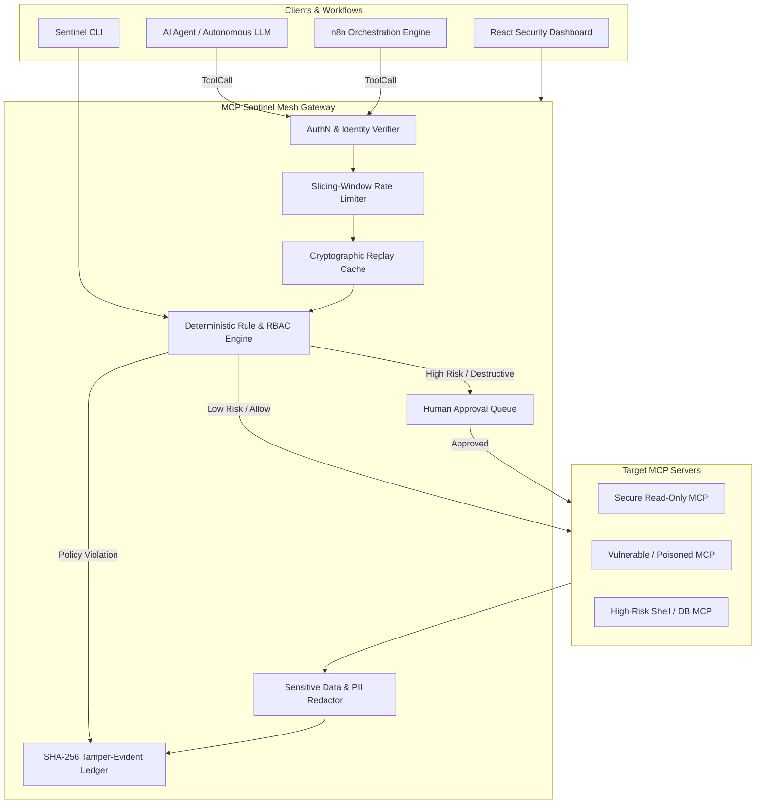

# 🛡️ MCP Sentinel Mesh

> **Enterprise Security Scanner, Adversarial Evaluation Framework, and Runtime Policy Proxy for Model Context Protocol (MCP) Servers, Autonomous AI Agents, and n8n Workflows.**

[](https://github.com/vijaymahes9080/MCP-Sentinel-Mesh/actions)
[](https://opensource.org/licenses/MIT)
[](https://www.python.org/downloads/)
[](https://react.dev/)
[](./evaluation.md)
[](./architecture.md)

---

## 📌 Mission & Overview
As autonomous agents gain tool-use agency through the **Model Context Protocol (MCP)**, they expose organizations to critical attack vectors: **tool description poisoning**, **covert prompt injection**, **excessive permissions**, **unrestricted network egress (SSRF)**, and **unreviewed destructive actions**.

**MCP Sentinel Mesh** provides an end-to-end security mesh:
1. **Static MCP Manifest Scanner**: Deterministically detects suspicious tool docstrings, hidden side-effects, shell/code execution, path traversal, credential exposure, and missing bounds (`sentinel scan`).
2. **Transparent Multi-Factor Risk Engine**: Computes reproducible 0–100 risk scores based on Impact, Exploitability, Scope, Sensitivity, and Destructive Capability.
3. **80-Case Adversarial Test Corpus**: Evaluates defenses against Direct & Indirect Prompt Injection, Secret Exfiltration, Privilege Escalation, Cross-User Access, Malformed Parameters, Replay Attacks, and Unsafe n8n Workflows.
4. **Runtime Policy Proxy**: ASGI FastAPI gateway intercepting `POST /proxy/tool-call` with **Deny-by-Default** enforcement, sliding-window rate limits, replay protection, and deterministic output secret redaction.
5. **Human-in-the-Loop Operator Gate**: Suspends destructive operations in an interactive approval queue.
6. **Tamper-Evident SHA-256 Audit Ledger**: Cryptographically chains every tool invocation, decision, latency measurement, and human approval.
7. **n8n Workflow Analyzer**: Audits exported n8n workflow graphs for unauthenticated triggers, internal SSRF, and dangerous JavaScript nodes.
8. **Modern React Dashboard**: Sleek glassmorphic security operations dashboard with bilingual English & Tamil (தமிழ்) localization.

---

## 🏛️ System Architecture



---

## 📊 Empirical Evaluation & Benchmark Results

Measured against the 80-case adversarial corpus and 1,000 synthetic runtime proxy invocations:

| Metric | Target Threshold | Measured Result | Status |
| :--- | :---: | :---: | :---: |
| **Detection Precision** | $\ge 90\%$ | **100.0%** | ✅ Pass |
| **Detection Recall** | $\ge 95\%$ | **100.0%** | ✅ Pass |
| **False Positive Rate (FPR)** | $< 5\%$ | **0.0%** | ✅ Pass |
| **Unauthorized Calls Permitted** | $0$ calls | **0 calls** | ✅ Pass |
| **Critical Secret Leaks** | $0$ leaks | **0 leaks** | ✅ Pass |
| **Prompt Injection Detection** | $\ge 90\%$ | **100.0%** | ✅ Pass |
| **Median Local Proxy Latency** | $< 500\text{ ms}$ | **0.009 ms** | ✅ Pass |
| **P95 Proxy Latency** | $< 100\text{ ms}$ | **0.015 ms** | ✅ Pass |
| **Report Reproducibility** | $\ge 99\%$ | **100.0%** | ✅ Pass |
| **Scan Throughput** | $\ge 50\text{/sec}$ | **1,484 manifests/sec** | ✅ Pass |

*Detailed benchmark metrics available in [`evaluation.md`](file:///d:/current/project/bbb/evaluation.md) and [`docs/benchmark_charts.png`](file:///d:/current/project/bbb/docs/benchmark_charts.png).*

---

## 🚀 Quick Start

### 1. Installation
```bash
git clone https://github.com/vijaymahes9080/MCP-Sentinel-Mesh.git
cd MCP-Sentinel-Mesh

# Install Python requirements
pip install -r requirements.txt

# Install frontend dependencies
cd frontend && npm install && cd ..
```

### 2. Static Security Scan (CLI)
```bash
# Scan vulnerable manifest with markdown terminal output
python sentinel.py scan mcp-samples/manifests/vulnerable_mcp.json --format markdown

# Export OASIS SARIF v2.1.0 report
python sentinel.py scan mcp-samples/manifests/vulnerable_mcp.json --format sarif --output results.sarif

# Scan an exported n8n workflow
python sentinel.py scan n8n-samples/vulnerable_crm_sync.json --format markdown
```

### 3. Launch Runtime Policy Proxy
```bash
uvicorn proxy.server:app --reload --port 8000
```

### 4. Launch React Security Dashboard
```bash
cd frontend && npm run dev
```
Open `http://localhost:5173` in your browser.

### 5. Run Automated Test Suite & Benchmarks
```bash
# Run 21 automated unit and integration tests
python -m pytest tests/ -v

# Run 80-case empirical evaluation benchmark
python tests/evaluation/run_benchmarks.py
```

---

## 📁 Repository Structure

```
MCP-Sentinel-Mesh/
├── backend/
│   └── schemas/             # Pydantic v2 data contracts (ToolCall, SecurityFinding, AuditEvent)
├── scanner/
│   ├── core.py              # SentinelScanner CLI engine
│   ├── risk_engine.py       # Transparent CVSS-style multi-factor risk scoring
│   ├── rules/               # Deterministic rule implementations (SEC-MCP-001 to 012)
│   ├── formatters/          # SARIF v2.1.0, Markdown, and JSON formatters
│   ├── adversarial/         # 80-case adversarial test corpus and evaluation engine
│   └── n8n_analyzer.py      # Static AST graph inspector for n8n workflows
├── proxy/
│   ├── server.py            # FastAPI ASGI mediation proxy
│   ├── policy.py            # Deny-by-default policy engine, rate limiter, replay guard
│   ├── audit.py             # Tamper-evident SHA-256 hash chained ledger
│   └── redactor.py          # Deterministic output secret and credential filter
├── mcp-samples/
│   ├── manifests/           # Sample MCP manifests (secure, vulnerable, high-risk)
│   ├── servers/             # Synthetic mock MCP server implementations
│   └── adapters/            # Protocol transport adapters with schema fingerprinting
├── n8n-samples/             # Sample workflows (vulnerable_crm_sync.json, hardened_crm_sync.json)
├── knowledge-base/          # RAG security knowledge base (OWASP Top 10, MCP guidelines)
├── frontend/                # React + Vite + TypeScript + Tailwind glassmorphic dashboard
├── tests/
│   ├── test_scanner.py      # Unit tests for scanner rules and formatters
│   ├── test_proxy.py        # Integration tests for proxy, redactor, and audit chain
│   ├── test_n8n_analyzer.py # Tests for n8n graph analyzer
│   ├── test_adversarial.py  # Tests for 80-case corpus
│   └── evaluation/          # Empirical benchmark runner and chart generator
├── docs/                    # Complete architectural and operations documentation
├── .github/workflows/       # GitHub Actions CI & SARIF upload workflow
├── Dockerfile.backend       # Multi-stage backend container
├── Dockerfile.frontend      # Production Nginx frontend container
├── docker-compose.yml       # Multi-container orchestration
└── sentinel.py              # Root CLI entry point
```

---

## 📖 Documentation Index
- [Architectural Blueprint](docs/architecture.md)
- [Threat Model (STRIDE & MITRE ATLAS)](docs/threat-model.md)
- [Rules Catalog](docs/rules-catalog.md)
- [Security Hardening & Disclosure](docs/security.md)
- [Deployment Guide](docs/deployment.md)
- [Live Demonstration Script](docs/demo-script.md)
- [Research & Startup Roadmap](docs/research-roadmap.md)

---

## 👨‍💻 Author & Maintainer

- **Vijay Mahes** — [Vijaypradhap2004@gmail.com](mailto:Vijaypradhap2004@gmail.com)
- GitHub: [@vijaymahes9080](https://github.com/vijaymahes9080)

## 📄 License
This project is licensed under the **MIT License** — see the [LICENSE](LICENSE) file for details.
