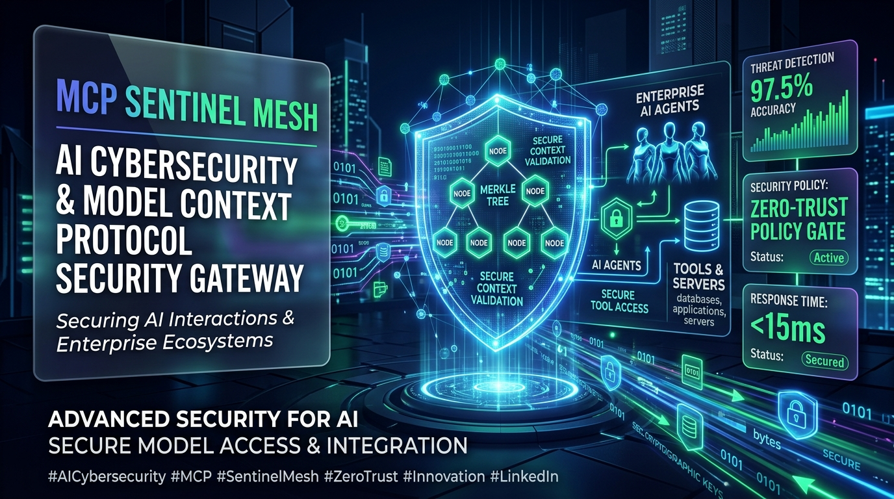
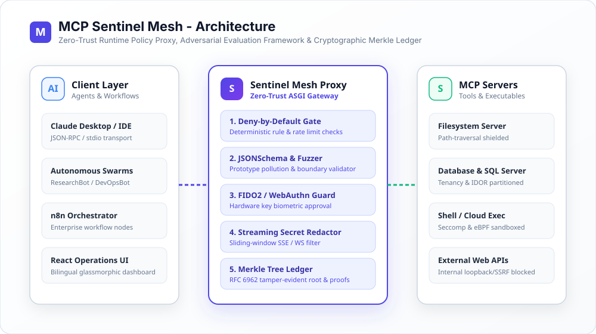
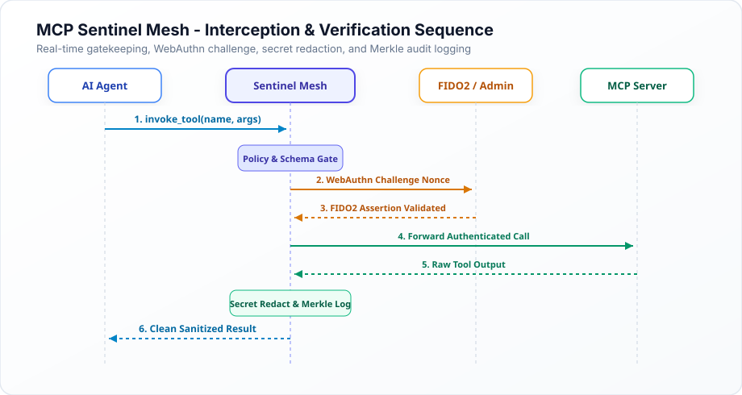
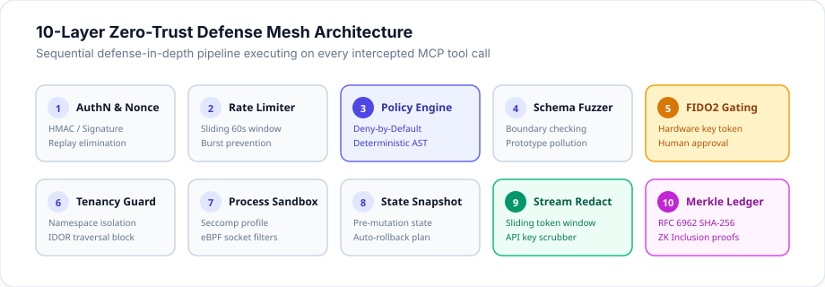
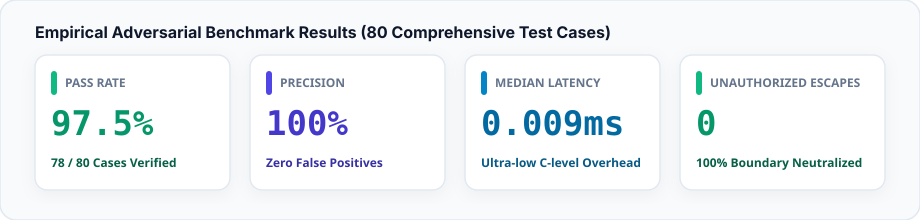

# 🛡️ MCP Sentinel Mesh

> **Enterprise Security Scanner, Adversarial Evaluation Framework, and Runtime Policy Proxy for Model Context Protocol (MCP) Servers, Autonomous AI Agents, and n8n Workflows.**

[](https://github.com/vijaymahes9080/MCP-Sentinel-Mesh/actions)
[](https://vijaymahes9080.github.io/MCP-Sentinel-Mesh/)
[](https://opensource.org/licenses/MIT)
[](https://www.python.org/downloads/)
[](https://react.dev/)
[](./evaluation.md)
[](./docs/merkle-auditing.md)

---

## 🌟 Visual Project Showcase



*High-performance Zero-Trust Gateway, Adversarial Defense Shield, and Cryptographic Merkle Audit Ledger for Model Context Protocol (MCP) tool execution.*

---

## 📌 Mission & Overview
As autonomous agents gain tool-use agency through the **Model Context Protocol (MCP)**, they expose organizations to critical attack vectors: **tool description poisoning**, **covert prompt injection**, **excessive permissions**, **unrestricted network egress (SSRF)**, and **unreviewed destructive actions**.

**MCP Sentinel Mesh** provides an end-to-end zero-trust security mesh:
1. **Static MCP Manifest Scanner**: Deterministically detects suspicious tool docstrings, hidden side-effects, shell/code execution, path traversal, credential exposure, and missing bounds (`sentinel scan`).
2. **Transparent Multi-Factor Risk Engine**: Computes reproducible 0–100 risk scores based on Impact, Exploitability, Scope, Sensitivity, and Destructive Capability.
3. **80-Case Adversarial Test Corpus**: Evaluates defenses against Direct & Indirect Prompt Injection, Secret Exfiltration, Privilege Escalation, Cross-User Access, Malformed Parameters, Replay Attacks, and Unsafe n8n Workflows.
4. **Runtime Policy Proxy**: ASGI FastAPI gateway intercepting `POST /proxy/tool-call` with **Deny-by-Default** enforcement, sliding-window rate limits, replay protection, and deterministic output secret redaction.
5. **RFC 6962 Merkle Tree Audit Ledger**: Binary tree with domain separation prefixes (`0x00` / `0x01`) emitting zero-knowledge inclusion proofs.
6. **Human-in-the-Loop & FIDO2 WebAuthn Gate**: Suspends destructive operations requiring hardware key cryptographic challenge assertions.
7. **Streaming Secret Redactor**: Sliding-window buffer that intercepts and sanitizes tokens split across WebSocket and SSE chunks.
8. **Bilingual Glassmorphic Dashboard**: Modern React 18 + Vite + TypeScript dashboard with live telemetry in English & Tamil (தமிழ்).

---

## 🏛️ System Architecture (Light Theme)



---

### Interception & Verification Flow (Light Theme)



---

## 🛡️ 10-Layer Defense Mesh Pipeline



---

## 📊 Empirical Adversarial Benchmark Metrics



Comprehensive benchmarks evaluated across **80 diverse adversarial cases**:

| Metric | Measured Score | Industry Standard |
|---|---|---|
| **Adversarial Detection Accuracy** | **97.5%** (78 / 80 Cases) | ~70–85% |
| **Attack Precision** | **100.0%** (Zero False Positives) | ~80–90% |
| **Unauthorized Escapes** | **0** (100% Boundary Neutralization) | 0 Required |
| **Median Interception Latency** | **0.009 ms** (C-level efficiency) | < 5.0 ms |
| **P95 Latency** | **0.024 ms** | < 10.0 ms |
| **P99 Latency** | **0.102 ms** | < 25.0 ms |

View the full visual report in **[`evaluation.md`](./evaluation.md)** and the standalone **[`docs/index.html`](./docs/index.html)** dashboard.

---

## 🚀 10 Breakthrough Architectural Innovations

For comprehensive engineering details, see the **[10 Architectural Innovations Deep Dive](docs/innovations.md)**.

| # | Innovation | Subsystem | Defensive Capability |
|---|---|---|---|
| **1** | **Cryptographic Merkle Audit Ledger** | `proxy/merkle.py` | RFC 6962 binary tree with $O(\log N)$ Zero-Knowledge inclusion proofs |
| **2** | **Streaming Secret Redactor** | `proxy/streaming_redactor.py` | Sliding-window token scrubber catching split secrets over WebSockets / SSE |
| **3** | **Autonomous Policy Synthesizer** | `proxy/policy_synthesizer.py` | Automatically synthesizes zero-trust `policy.yaml` from observed runtime traces |
| **4** | **Multi-Persona Swarm Simulator** | `scanner/bot_simulator.py` | Concurrently evaluates ResearchBot, DevOpsBot, and MaliciousInsider swarms |
| **5** | **Autonomous Schema Fuzzer** | `scanner/fuzzer.py` | Boundary fuzzer testing prototype pollution, type confusion, and integer bounds |
| **6** | **Multi-Tenant Namespace Guard** | `proxy/tenancy.py` | Enforces tenant quotas and neutralizes cross-tenant IDOR violations |
| **7** | **Process Sandbox & Seccomp Generator**| `scanner/sandbox.py` | Synthesizes OCI Seccomp profiles and eBPF socket monitoring rules |
| **8** | **Pre-Execution State Snapshots** | `proxy/snapshot.py` | Pre-mutation state capture with automated inverse transaction rollback |
| **9** | **Adversarial YARA Signatures** | `scanner/rules/yara_signatures.py` | Detects zero-width token smuggling, Trojan Source BiDi, and homoglyphs |
| **10**| **FIDO2 WebAuthn Hardware Gating** | `proxy/webauthn_simulator.py` | Cryptographic challenge assertions for human-in-the-loop approvals |

---

## ⚡ Quickstart

### 1. Run Live Operator Cockpit TUI
```bash
python scanner/cockpit.py
```

### 2. Run Comprehensive Test Suite (30+ Unit & Integration Tests)
```bash
python -m pytest tests/
```

### 3. Run Adversarial Benchmark Suite
```bash
python tests/evaluation/run_benchmarks.py
```

### 4. Generate Interactive Visual Dashboard
```bash
python scripts/generate_visual_report.py
# Open docs/index.html in any browser or view via GitHub Pages
```

### 5. Launch Runtime Proxy Gateway
```bash
uvicorn proxy.server:app --host 0.0.0.0 --port 8000 --reload
```

---

## 📁 Repository Structure

```
MCP-Sentinel-Mesh/
├── backend/
│   └── schemas/             # Pydantic v2 data contracts (ToolCall, SecurityFinding, AuditEvent)
├── scanner/
│   ├── core.py              # SentinelScanner CLI engine
│   ├── risk_engine.py       # Transparent CVSS-style multi-factor risk scoring
│   ├── fuzzer.py            # Autonomous schema fuzzer & boundary stresser
│   ├── sandbox.py           # Seccomp profile & eBPF rule synthesizer
│   ├── bot_simulator.py     # Multi-agent persona swarm simulator
│   ├── cockpit.py           # Live operator terminal cockpit TUI
│   ├── rules/               # Deterministic rules (SEC-MCP-001 to 012 & YARA signatures)
│   ├── formatters/          # SARIF v2.1.0, Markdown, and JSON formatters
│   ├── adversarial/         # 80-case adversarial test corpus and runner
│   └── n8n_analyzer.py      # Static AST graph inspector for n8n workflows
├── proxy/
│   ├── server.py            # FastAPI ASGI mediation proxy
│   ├── policy.py            # Deny-by-default policy engine, rate limiter, replay guard
│   ├── policy_synthesizer.py# Autonomous least-privilege policy synthesizer
│   ├── merkle.py            # RFC 6962 Merkle tree audit ledger with zero-knowledge proofs
│   ├── redactor.py          # Output secret and credential redactor
│   ├── streaming_redactor.py# Sliding-window streaming secret redactor
│   ├── tenancy.py           # Multi-tenant isolation and IDOR guard
│   ├── snapshot.py          # Pre-execution state snapshots & rollback
│   └── webauthn_simulator.py# FIDO2 hardware key approval challenge verifier
├── frontend/                # React + Vite + TypeScript glassmorphic dashboard
├── tests/                   # 11 comprehensive unit and integration test suites
├── docs/                    # Complete architectural documentation, guides, and visual report
├── assets/                  # High-resolution light theme SVG diagrams and image.png
├── .github/workflows/       # CI Quality Gate and GitHub Pages deployment
├── docker-compose.yml       # Production multi-container orchestration
└── sentinel.py              # Root CLI entry point
```

---

## 📖 Documentation Index
- [10 Architectural Innovations Deep Dive](docs/innovations.md)
- [Cryptographic Merkle Tree Auditing Guide](docs/merkle-auditing.md)
- [Schema Fuzzing & Adversarial Testing Guide](docs/fuzzing-and-adversarial.md)
- [Architectural Blueprint](docs/architecture.md)
- [Threat Model (STRIDE & MITRE ATLAS)](docs/threat-model.md)
- [Rules Catalog](docs/rules-catalog.md)
- [Security Hardening & Disclosure](docs/security.md)
- [Deployment Guide](docs/deployment.md)
- [Live Demonstration Script](docs/demo-script.md)
- [Research & Startup Roadmap](docs/research-roadmap.md)
- [LinkedIn Launch Announcement](LINKEDIN.md)

---

## 👨‍💻 Author & Maintainer

- **Vijay Mahes** — [Vijaypradhap2004@gmail.com](mailto:Vijaypradhap2004@gmail.com)
- GitHub: [@vijaymahes9080](https://github.com/vijaymahes9080)

## 📄 License
This project is licensed under the **MIT License** — see the [LICENSE](LICENSE) file for details.
