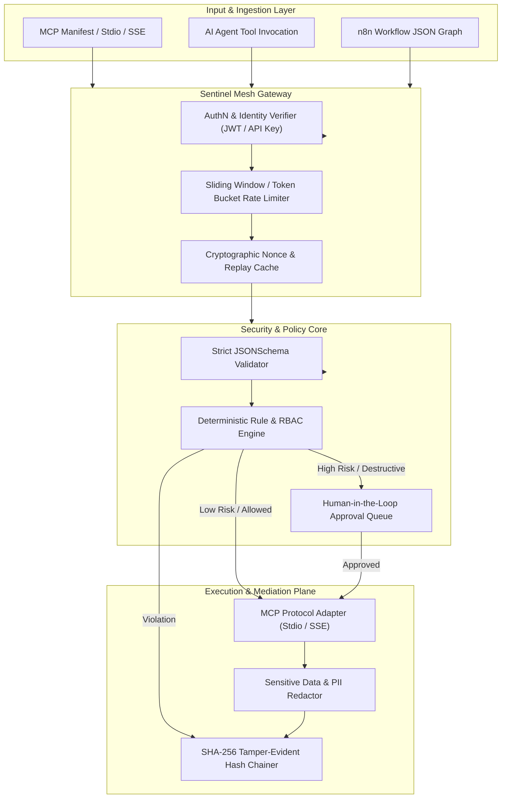

# Architecture Blueprint: MCP Sentinel Mesh

## 1. System Topology

---

## 2. Component Design & Responsibilities

### 2.1 Static Scanner (`scanner/core.py`)
- Reads JSON/YAML tool manifests or connects dynamically to MCP server capabilities.
- Evaluates against the rules catalog (`scanner/rules/`).
- Computes aggregate risk scores and outputs reports in Markdown, JSON, and SARIF v2.1.0 formats.

### 2.2 Risk Engine (`scanner/risk_engine.py`)
Computes the compound risk formula:
$$\text{RawScore} = \min\left(100.0, \; \sum_{i} w_i \cdot F_i\right) \times C$$
Where:
- $F_{\text{impact}}$: Potential blast radius (data destruction, privilege acquisition). Weight = 2.5
- $F_{\text{exploit}}$: Ease of trigger via prompt injection or unvalidated args. Weight = 2.0
- $F_{\text{scope}}$: Permission breadth (`read`, `write`, `execute`, `admin`). Weight = 1.5
- $F_{\text{destruct}}$: Mutability or deletion flag. Weight = 2.0
- $F_{\text{exposure}}$: Network/public reachability. Weight = 1.0
- $F_{\text{sensitivity}}$: Classification level (`public` to `restricted`). Weight = 1.0
- $C$: Confidence multiplier ($0.7$ for suspected, $0.9$ for detected, $1.0$ for confirmed).

### 2.3 Runtime Policy Proxy (`proxy/server.py`)
- Provides an ASGI FastAPI proxy intercepting `POST /proxy/tool-call`.
- Enforces strict input validation before sending to downstream MCP servers.
- Redacts sensitive credentials (AWS keys, OpenAI tokens, database passwords, JWTs) from responses before returning them to calling agents.
- Provides `/approvals` API endpoints for human operator authorization.

### 2.4 Cryptographic Audit Ledger (`proxy/audit.py`)
- Implements a blockchain-inspired SHA-256 hash-chained log.
- Each event includes `event_id`, `sequence_index`, `previous_hash`, `timestamp`, `principal`, `action`, `decision`, and `payload_digest`.
- Verification routine checks entire ledger sequence to guarantee zero tampering.

### 2.5 n8n Graph Analyzer (`scanner/n8n_analyzer.py`)
- Parses nodes and connections in exported n8n workflow JSON.
- Evaluates webhook authentication, code execution nodes (`n8n-nodes-base.code`), unvalidated HTTP requests, and loop structures.

### 2.6 RAG Knowledge Base (`knowledge-base/engine.py`)
- Indexes cybersecurity standards, CVE advisories, and MITRE ATLAS matrices.
- Provides exact-passage citations for remediation suggestions without influencing deterministic policy decisions.
